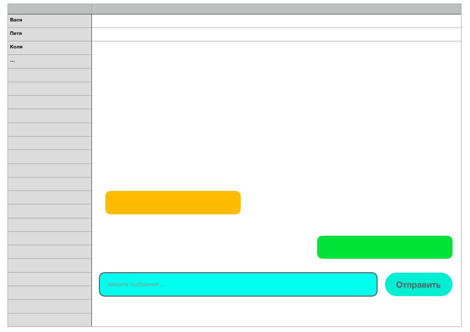

.. yet_another_chat documentation master file, created by
   sphinx-quickstart on Wed May  5 13:07:24 2021.
   You can adapt this file completely to your liking, but it should at least
   contain the root `toctree` directive.

Welcome to yet_another_chat's documentation!
============================================

.. toctree::
   :maxdepth: 2
   :caption: Contents:
   
   rules
   
UI
==

Indices and tables
==================

* :ref:`genindex`
* :ref:`modindex`
* :ref:`search`
